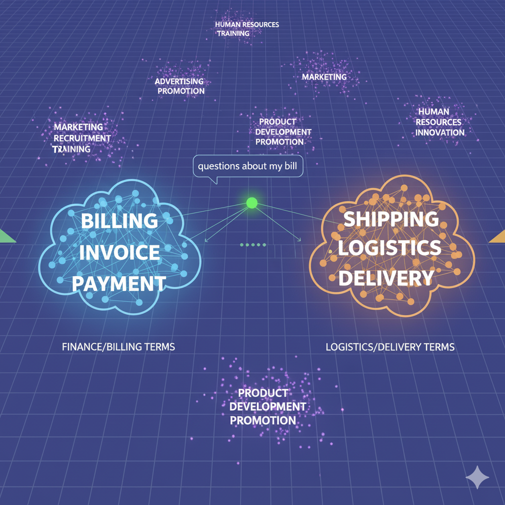

**How Embeddings Work: A Coordinate System for Meaning**

## The Unstructured Data Challenge

In the previous section, we discussed the strategic need for a searchable knowledge base to make an LLM "aware" of your proprietary business information. But this raises a fundamental technical question: How can a computer, which operates on numbers and logic, possibly "search" through human language, which is filled with ambiguity, context, and nuance?

For decades, the primary method was **keyword search**. If you searched for the word "billing," the system would return documents containing that exact word. While useful, this approach is brittle. It would fail to find a document that talked about "invoices," "payments," or "statements" if it didn't use the specific keyword "billing."

To build a truly intelligent system, we need to move from searching for *words* to searching for *meaning*. This is the problem that embedding models are designed to solve.

### The Core Concept
**Translating Meaning into Mathematics**

The central innovation of text embeddings is the ability to translate the abstract, semantic qualities of language into a structured, mathematical format. An embedding model takes a piece of text and maps it to a specific location in a vast, multi-dimensional space. This location is defined by its vector—its list of numerical coordinates.

This process is not random; it is highly structured. The model is trained on enormous volumes of text (like a significant portion of the internet) to learn the relationships between words and concepts. It learns that "king" and "queen" are related in a similar way to how "man" and "woman" are related. It learns that "invoice" and "bill" are semantically much closer than "invoice" and "delivery truck."

The result is a high-dimensional "map of meaning," where the position of each text vector is determined by its semantic content.

### Analogy: The Semantic GPS

Perhaps the most effective way to conceptualize this vector space is as a **Semantic GPS**.

Imagine a giant, invisible globe. Instead of representing physical locations, this globe represents semantic concepts. When you create an embedding for a piece of text, you are asking the model to place a pin on this globe at the precise coordinates of that text's meaning.

* A customer's email asking, "**Where is my package?**" will place a pin at a specific set of coordinates.
* Another customer's chat message, "**Can I get an update on my delivery status?**" will place another pin at a location *very close* to the first one. Even though the words are different, the underlying intent—the meaning—is nearly identical.
* In contrast, a query about "**your company's return policy**" will place a pin in a completely different region of the globe, far from the shipping-related queries.

This "semantic proximity" is the key. It allows us to use simple mathematical calculations to perform powerful linguistic operations. By calculating the "distance" between the vector for a user's query and the vectors of all the documents in our knowledge base, we can find the documents whose meaning is closest to the user's question. This is the foundation of modern semantic search, and it is exponentially more powerful and nuanced than traditional keyword search.

<!-- **(Placeholder for a visual diagram: A 2D or 3D representation of a vector space. It would show clusters of related terms like "billing," "invoice," and "payment" grouped together, while other terms like "shipping," "logistics," and "delivery" form another distinct cluster. A user query "questions about my bill" would be shown as a point closer to the first cluster.)** -->

{width=500}

### The Embedding Model's Role
**The Cartographer of Meaning**

The quality of this semantic map depends entirely on the skill of its cartographer—the **embedding model**.

The embedding model is a specialized type of neural network (often a Transformer, the same underlying architecture as LLMs) that has been trained specifically for this translation task. Its sole purpose is to become an expert at reading a piece of text and assigning it the most accurate possible coordinates in the high-dimensional vector space.

The difference between a good embedding model and a great one lies in its nuance. A great model can understand subtle differences in context:

* It knows that "apple" in the context of "Apple Inc." should be mapped to a different location than "apple" in the context of "apple pie."
* It can distinguish between the sentiment of "The service was unbelievably good" and "The service was unbelievably bad."

Therefore, selecting a high-quality embedding model is a critical business decision. The quality of this model determines the precision of your search results, which, as we will explore in a later section, directly impacts the accuracy and reliability of the final answer generated by your LLM.

**The Case for the "Local Guide": Domain-Specific Embedding Models**

A **domain-specific embedding model** is a model that has been further trained on a massive corpus of text from a particular field, such as law, finance, or medicine. This specialized training makes it an expert "local guide" for that industry's unique language.

Consider these examples:

* **Legal Domain:** To a general model, the phrase "material adverse change" might seem vague. But in a legal contract, it has a very precise, heavily litigated meaning. A law-specific model (like VoyageAI's Voyage-Law-2) is trained on millions of legal documents and court filings. It understands this nuance and can create a much more accurate semantic map for legal concepts, ensuring that a search for a specific contractual clause is far more precise.
* **Finance Domain:** In a financial context, the word "alpha" isn't just a letter of the Greek alphabet; it refers to a measure of investment performance. The term "liquidity" has meanings far beyond its general dictionary definition. A finance-specific model (like Voyage-Finance-2) is trained on financial reports, SEC filings, and market analysis, allowing it to grasp these specialized meanings accurately.

**The Strategic Decision:**

As a product manager or strategist, this presents a critical choice:

1.  **General-Purpose Model:** Is your use case broad enough (e.g., a general customer service bot) that a high-quality "world atlas" model is sufficient?
2.  **Domain-Specific Model:** Is the accuracy of your application so dependent on understanding industry-specific jargon that the investment in a specialized "local guide" model is justified?

The decision hinges on the required precision of your application and the potential cost of misunderstanding nuanced language. In the next section, we will explore the tools and benchmarks, like MTEB, that help you evaluate both general and specialized models to make this strategic decision effectively.