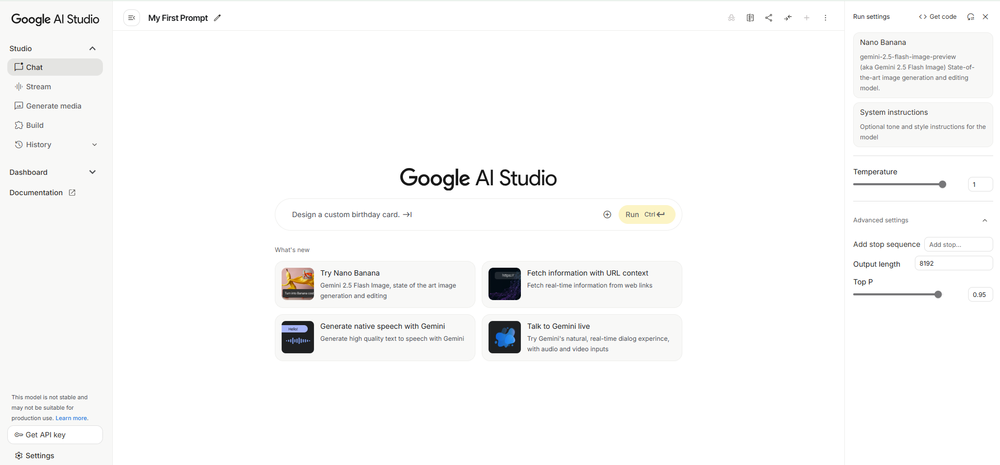

# The Configuring Model Responses

In the last section, we established the blueprint for a high-quality prompt by defining its four core components. You now have the framework for crafting the *what*—the instructions you give to the model.

Now, we turn our attention to the *how*. Beyond the prompt itself lies a powerful "control panel" of configuration settings. For a product manager, these settings are the essential dials and levers you will use to tune the AI's behavior. Mastering them is the key to managing the critical trade-offs between creativity, factual accuracy, brand consistency, and cost.

## How LLMs Generate Text: A PM's Guide to Next Token Prediction

To understand the control panel, you first need a basic mental model of how an LLM generates text. At its heart, an LLM is a prediction engine. When given a prompt, it doesn't "know" the answer in a human sense. Instead, it calculates the probabilities for what the next word (or, more accurately, "token") should be based on the patterns it learned from its vast training data. It predicts the most likely next token, adds that token to the sequence, and then repeats the process over and over to generate a full response.

### The Default: Greedy Decoding

The most straightforward way for a model to generate text is called **greedy decoding**. In this mode, the model simply selects the single token with the absolute highest probability at each step.

This process is **deterministic**; given the same prompt, a model using greedy decoding will produce the exact same output every time. This is equivalent to setting the **Temperature** dial on your control panel to **0**. While predictable, this approach often leads to text that is repetitive, rigid, and lacks nuance.

!!! success "👩‍💼 The PM Perspective"

    **Matching the Tool to the Task**

    Your primary job as a PM is to ensure the AI's behavior perfectly aligns with the user's task. The first step is to categorize the task:

    * **Understanding Tasks:** These are tasks where accuracy and predictability are paramount. This includes text summarization, information extraction, classification, and parsing data.
    * **Generation Tasks:** These are tasks where creativity, diversity, and novelty are valuable. This includes brainstorming ideas, writing marketing copy, or creating a story.

    Greedy decoding (`Temperature = 0`) is not inherently undesirable; in fact, for many **understanding tasks**, it is the **correct and most reliable choice**. You want a model to extract a customer's address from an email with perfect, deterministic accuracy every time.

    The danger lies in **misalignment**. Using a high temperature ("creative mode") for a data extraction task is a recipe for hallucinations and product failure. Conversely, using a low temperature ("predictable mode") for a brainstorming feature will result in a boring, uninspired product that fails to deliver value. Your role is to intentionally select and tune the right setting for the specific job to be done.

## Introducing Sampling Controls

Before you touch any of the dials on the control panel, the first and most fundamental choice you make as a product manager is **selecting the right model for the job**. As you learned in a previous lesson, different models (like Gemini, Claude, or Llama) have different capabilities, costs, and performance characteristics. Prompts often need to be optimized for the specific model you are using.

Once you've chosen your model, you can then use sampling controls to tune its behavior. These are the settings that introduce a degree of randomness into the token selection process, allowing you to move beyond the deterministic nature of greedy decoding to get more interesting and useful results.

To move beyond the limitations of greedy decoding, we use **sampling controls**. These are the settings that introduce a degree of randomness into the token selection process, allowing the model to sometimes choose a less-obvious word to create more diverse and creative outputs. These controls are the primary dials on your product management control panel.

### Temperature

Temperature is the most common setting for controlling the randomness of the model's output.

* **Low Temperature (e.g., 0.1 - 0.3):** This makes the model's choices closer to greedy decoding. It will almost always pick the highest-probability tokens, resulting in responses that are more predictable, factual, and focused. This is ideal for tasks that require a single, correct answer.
* **High Temperature (e.g., 0.8 - 1.0):** This increases the randomness, allowing the model to select less-likely tokens more often. This leads to more diverse, unexpected, and creative results.

!!! example "Temperature"

    **Prompt:** `Write a one-sentence slogan for a new brand of coffee.`

    **Output (Temperature = 0.2):** `The best part of waking up is our coffee in your cup.`

    **Output (Temperature = 0.9):** `Brew the rebellion, one powerful drop at a time.`

### Top-K and Top-P

Top-K and Top-P are two additional methods to control randomness by restricting the pool of tokens the model can choose from at each step.

* **Top-K:** This setting limits the model's selection to the top *K* most probable tokens. A Top-K of 40 means that at each step, the model will only consider the 40 most likely next tokens. A low Top-K makes the model more restrictive and factual, while a high Top-K allows for more creativity.
* **Top-P (Nucleus Sampling):** This setting is a bit more dynamic. Instead of limiting to a fixed number of tokens, it limits the selection to the smallest possible set of tokens whose cumulative probability is greater than *P*. A Top-P of 0.95 means the model will consider only the most likely tokens that, together, add up to a 95% probability of being next.

!!! tip "💡 Pro-Tip: How the Dials Interact"

    When using a model where Temperature, Top-K, and Top-P are all available, they work together in a sequence:

    1.  The model first identifies tokens that meet both the **Top-K** and **Top-P** criteria.
    2.  Then, the **Temperature** setting is applied to this filtered list of tokens to perform the final random sampling.
    
    Be aware of edge cases. If you set **Temperature to 0** or **Top-K to 1**, the other settings become irrelevant because the model is forced into greedy decoding.
    
    **Recommended Starting Points:**

    * For **creative tasks**, try starting with a Temperature of 0.9, Top-P of 0.99, and Top-K of 40.
    * For tasks with a **single correct answer**, start with a Temperature of 0.

### Output Length

The final essential dial is the output length, which controls the maximum number of tokens to generate in a response.

!!! success "👩‍💼 The PM Perspective"

    **Your Most Important Business Control**

    As a product manager, this setting is your direct control over the cost and performance of your AI feature. Generating more tokens requires more computation, which leads to:

    * **Higher Costs:** Most API pricing is based on the number of tokens generated.
    * **Slower Response Times (Higher Latency):** More tokens take longer to generate.
    * **Higher Energy Consumption:** More computation uses more energy.

    It is crucial to understand that limiting the output length does not force the model to be more concise; it simply **cuts off the generation** once the limit is reached. To get a shorter response, you must also craft your prompt accordingly (e.g., "Summarize in a single sentence.").

## A Look at Google AI Studio

We've covered the core concepts behind the prompt engineering "control panel." To see how these theoretical dials translate into a real tool, we'll take a quick look at **Google AI Studio**, which we will use for our hands-on lab in the next part of our lesson.

AI Studio is a web-based 'playground' for experimenting with generative models. As a product manager, tools like this are invaluable for rapid prototyping because they allow you to test prompts and tune configurations instantly, without writing any code.

The screenshot below shows the main workspace in Google AI Studio. We've annotated the key areas to connect the concepts we've just discussed—like **Temperature**, **Top-K**, **Top-P**, and **Output Length**—to the actual sliders and fields you will be manipulating.

Study this layout to prepare for our next session, where you'll use this interface to complete a set of practical, hands-on exercises.

<figure markdown="span">
  { width="800" }
  <figcaption>Google AI Studio: New Chat Interface</figcaption>
</figure>

**Google AI Studio: User Interface Walkthrough**

This screenshot displays the main interface of Google AI Studio, a web-based tool for prototyping and running generative AI models. Below is a breakdown of the different sections and their functions.

### **Main Sections**

??? info "Left Navigation Menu" 

    This panel allows you to navigate between the different functionalities of the studio.

    *   **Studio:** This section contains tools for interacting with the AI models.
        *   **Chat:** An interface for having a conversational exchange with the AI.
        *   **Stream:** A mode for receiving continuous output from the model.
        *   **Generate media:** Tools for creating images, audio, or other media.
        *   **Build:** Options for more structured and complex AI applications.
        *   **History:** A log of your previous prompts and the AI's responses.

    *   **Dashboard:** Provides an overview of your projects and usage.
    *   **Documentation:** Access to guides, tutorials, and API references.
    *   **Get API key:** This button allows you to generate a key to use Google's AI models in your own applications.

??? info "Central Prompting Area" 

    This is the primary workspace where you interact with the AI.

    *   **`My First Prompt`:** This is the title of your current chat or project, which you can edit.
    *   **Prompt Input Field:** The text box where you type your instructions for the AI. In this example, the prompt is "Design a custom birthday card."
    *   **Run Button:** Click this button (or use the shortcut Ctrl+Enter) to send your prompt to the AI and get a response.
    *   **What's new:** This section highlights new and featured capabilities of the platform, such as generating images with "Nano Banana" or fetching real-time information from websites.

???+ info "Right-Hand Settings Panel :material-hand-pointing-left:"

    This area provides options to configure the AI model and its output. For this lesson, this panel is our primary focus

    **Model Selector:** A dropdown menu to choose the specific AI model you want to use. Here, "Nano Banana" (also known as gemini-2.5-flash-image-preview) is selected, which is specialized for image generation.

    **System Instructions:** An optional field where you can provide high-level instructions for the model to follow throughout the conversation (e.g., "be friendly and helpful").

    !!! tip "The Control Panel"
    
    **Run Settings / Advanced settings:** These are parameters that control the randomness and length of the AI's output.

    *   **Temperature:** A slider that controls the creativity of the response. A higher value (like 1) makes the output more random, while a lower value makes it more focused and deterministic.
    *   **Output length:** Sets the maximum number of tokens (words or parts of words) in the generated response.
    *   **Top P:** A parameter that influences the randomness of the output by controlling the nucleus sampling.
    *   **Add stop sequence:** Allows you to specify a sequence of characters that will signal the AI to stop generating text.

    ---

This interface is designed to be a playground for experimenting with generative AI, allowing you to quickly test ideas and fine-tune the model's behavior for your specific needs.

## Key Takeaways

The control panel is where a product manager translates business needs into model behavior.

* Use **Temperature** to manage the trade-off between factual consistency and creative ideation.
* Use **Top-K** and **Top-P** to keep the model's output focused and relevant.
* Use **Output Length** to directly manage the cost and latency of your AI product feature.

Now that you understand both the anatomy of a prompt and the controls on the panel, it's time to put it into practice. The next section is the **Hands-On Lab**, where you will use Google AI Studio to see the effect of these settings for yourself.

